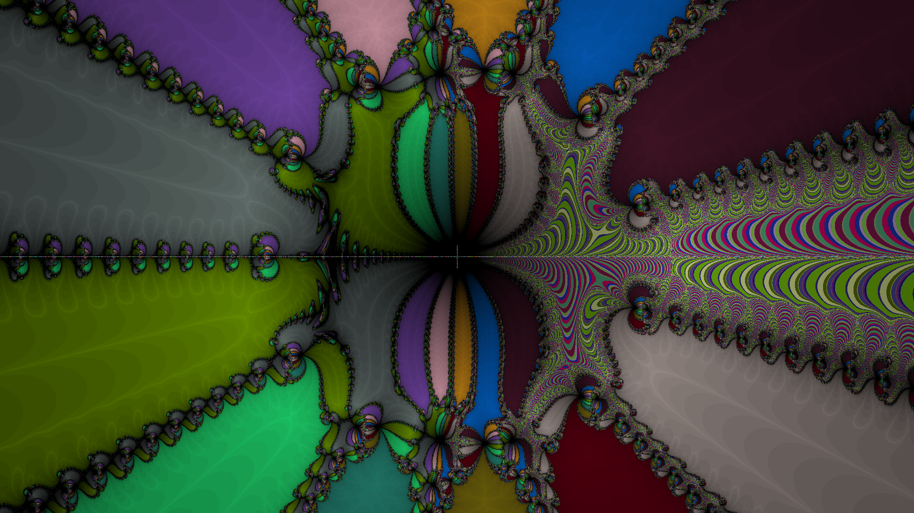
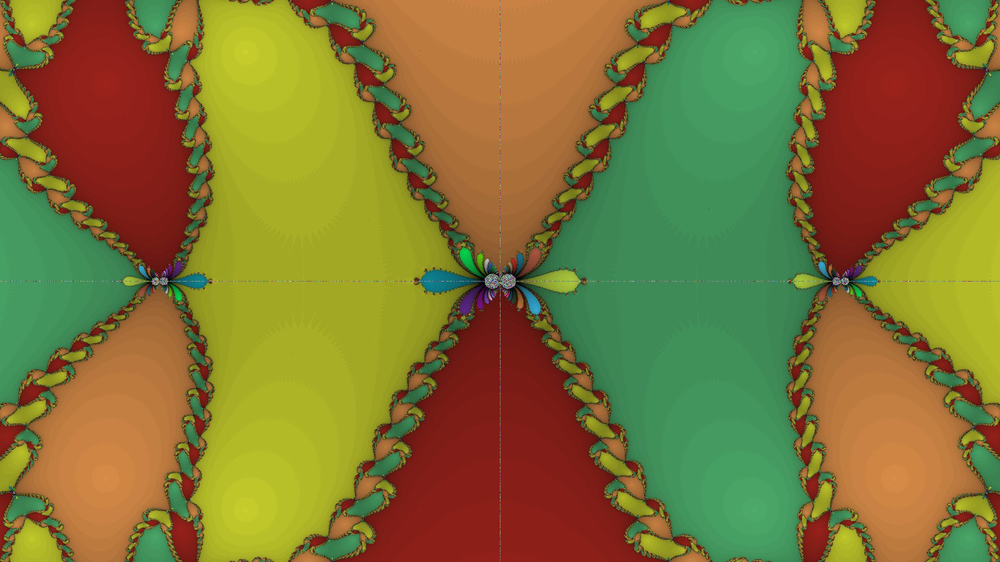
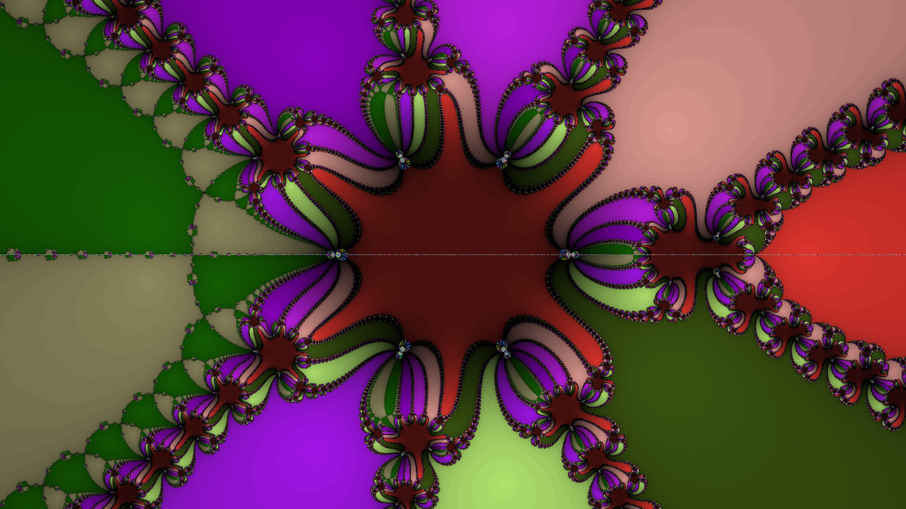

# Interactive Newtons Fractal Generator

Visaulization of Newton's Fractal written in C/C++. This program generates Newton's fractal based on polynomial provided in parameters and saves it to `.png` image.

---

# Table of contents

1. [Requirements](#requirements)
2. [How to use](#how-to-use)
3. [Paramaters](#parameters)
    - [Polynomial](#polynomial)
    - [`--size`](#size)
    - [`--name`](#name)
    - [`--zoom`](#zoom)
    - [`--no-saturation`](#saturation)
5. [How it works](#how-it-works)
6. [Gallery](#gallery)


---

# Requirements <a name="requirements"></a>

- Linux (tested on Ubuntu 20.04 LTS)

- g++ compiler
```bash
sudo apt intall g++
```

- ImageMagick
```bash
sudo apt install imagemagick
```

- Basic polynomials understanding :D
```bash
sudo learn polynomials
```

For better expirience i recommend you to watch awesome [3Blue1Brown's video](https://www.youtube.com/watch?v=-RdOwhmqP5s&t=709s) about Newton's fractal
and read [Wikipedia article](https://en.wikipedia.org/wiki/Newton_fractal).


---

# How to use <a name="how-to-use"></a>

Download `generate` file from root directory and call it
```bash
./generate "z^3 - 1"
```

If for some reason it doesn't work you can complie source code localy:

```bash
g++ -I/src src/main.cpp src/Complex.cpp -o generate -ldl
```
and call program as shown above.


---

# Parameters <a name="parameters"></a>

## Polymonial <a name="polynomial"></a>

To generate fractal you have to provide this argument.
Just put it in quotes after `./generate` like this:
```bash
./generate "z^4 - 1"
```

#### Formula for regular component:
```bash
az^n
```
where:
- a is an integer
- z is variable for polynomial (don't change it)
- n is a power of `z`

#### Examples:
```bash
./generate "-2z^14 - 2z^2 - z - 9"
```
```bash
./generate "5z^9 + 2z^8 - z^4 - 9"
```
```bash
./generate "-z^5 + 2z^4 - 19z^3 + z^2 - 18z - 2"
```

You can pick any polynomial as long as:
#### - it is in general form
This is **NOT** allowed:
```bash
./generate "(z - 9)(z + 2)(z - 12)(z + 16)"
```
#### - it's powers are whole, already calculated numbers (ints)
This is **NOT** allowed:
```bash
./generate "z^9*2 + 2z^2/8 - z^1/2 - 9"
```

You can also use tygonometric function like `sin`, `cos`, `sinh`, `cosh`;

#### Examples:
```bash
./generate "sin(z)"
```

```bash
./generate "2cosh(z)"
```

```bash
./generate "z^9 - 14z^4 - sinh(z) - 5"
```

```bash
./generate "-4cos(z) + z^8"
```

For some reason if you pass more than one trygonometric function it get's messy and takes a lot more time to generate, but I'm not smart enough to figure that out :)

---

## `--size` (Not required) <a name="size"></a>

Specify desired size of output image.

Default value is 500px x 500px

```bash
--size widthxheight
```

Where `width` and `height` are `int`

Example:

```bash
./generate "z^3 - 1" --size 1000x1000
```
This will generate image of size 1000px x 1000px

---

## `--name` (Not required) <a name="name"></a>

Specify name of output image

Default value is `Newtons-Fractal`

```bash
--name name
```
Where `name` is string

Example:

```bash
./generate "z^3 - 1" --name my_name_for_fractal
```
This will save the result in `my_name_for_fractal.png`

---

## `--zoom` (Not required) <a name="zoom"></a>

Specify zoom of image

Default value is `1`

```bash
--zoom zoom
```
where `zoom` is `double`

If `zoom < 1` image will be zoomed out.

If `zoom > 1` image will be zoomed in.

Example:
```bash
./generate "z^3 - 1" --zoom 0.1
```
This will zoom out 10 times.

Example:
```bash
./generate "z^3 - 1" --zoom 10
```
This will zoom in 10 times.

---

## `--no-saturation` (Not required) <a name="saturation"></a>

Turn off saturation

All colors won't have shades.

Example:
```bash
--no-saturation
```

# How it works <a name="how-it-works"></a>

Program contains 4 steps:

### Polynomial preprocessing
It takes polynomial provided in parameters and generates code compatible with `Complex` library and saves it to `tmp.cpp`.

### Compiling
Then it compiles generated code and creates library called `tmp.so`

### Loading library
Next step is loading generated library so generator can use functions created by parsing provided polynomial.

### Generating fractal
Last but not least it generates fractal. If you are interested in how exacly this works I strongly recommend you
awesome [3Blue1Brown's video](https://www.youtube.com/watch?v=-RdOwhmqP5s&t=709s) about this topic. Every time different colors are picked,
so you can easly say that your fractal is unique😊. When fractal is generated
it is saved to `.ppm` file. For user's convinience it is later converted to `.png` file and `.ppm` file is deleted.

---

# Gallery <a name="gallery"></a>

`./generate "z^4 - 17" --name gallery/1 --zoom 0.7 --size 1920x1080`


`./generate "-3cos(z) + z^13" --name gallery/2 --zoom 0.7 --size 1920x1080`


`./generate "-cosh(z) + z^4" --name gallery/3 --zoom 2 --size 1920x1080`


`./generate "-7z^9 + 14z^7 - sinh(z) + 17" --name gallery/4 --zoom 0.8 --size 1920x1080`


`./generate "z^6 + z^5 + z^4 + z^3 + z^2 + z + 1" --name gallery/5 --zoom 1 --size 1920x1080`


`./generate "sin(z) + cos(z) - sinh(z)" --name gallery/6 --zoom 1 --size 1920x1080`


`./generate "-9sin(z)" --name gallery/7 --zoom 0.1 --size 1920x1080`


`./generate "cosh(z) - z^20 + cos(z)" --name gallery/8 --zoom 1`


`./generate "sinh(z) - z^20 + cos(z) - sin(z)" --name gallery/9 --zoom 1 --size 1920x1080`


